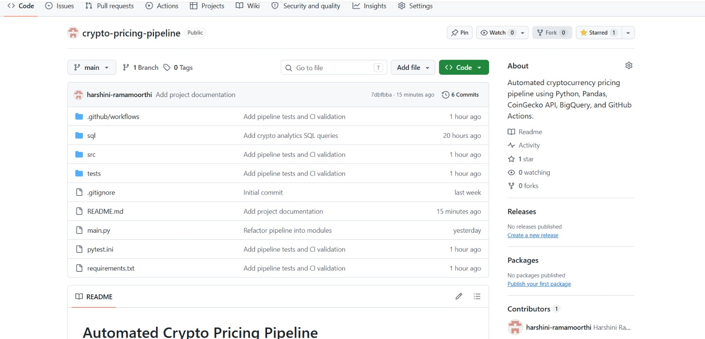
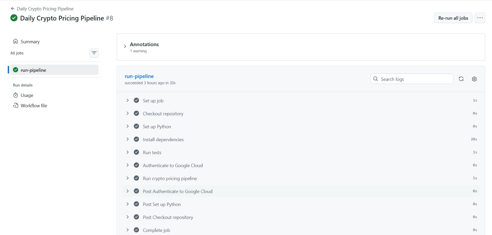
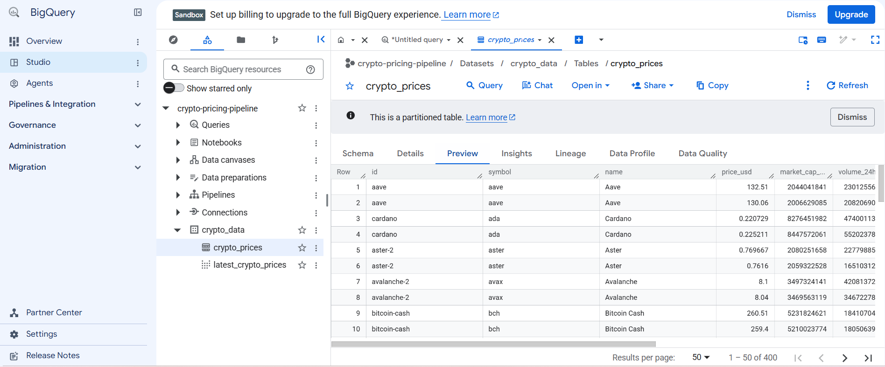
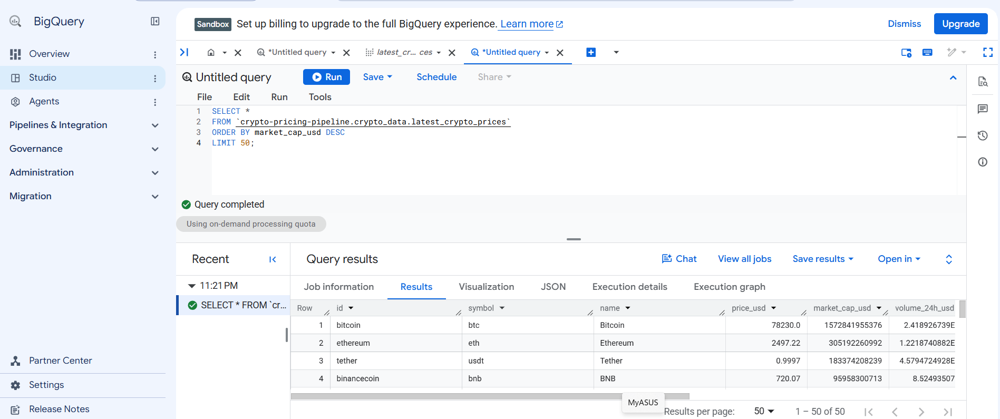
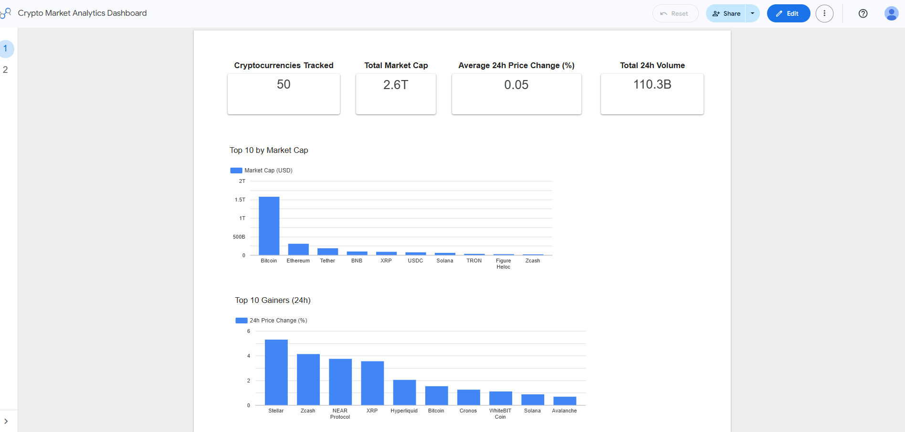
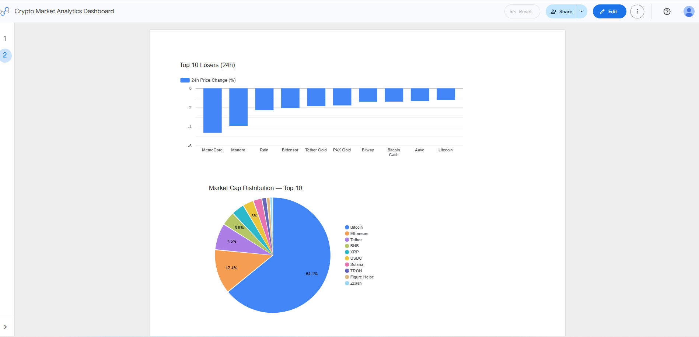
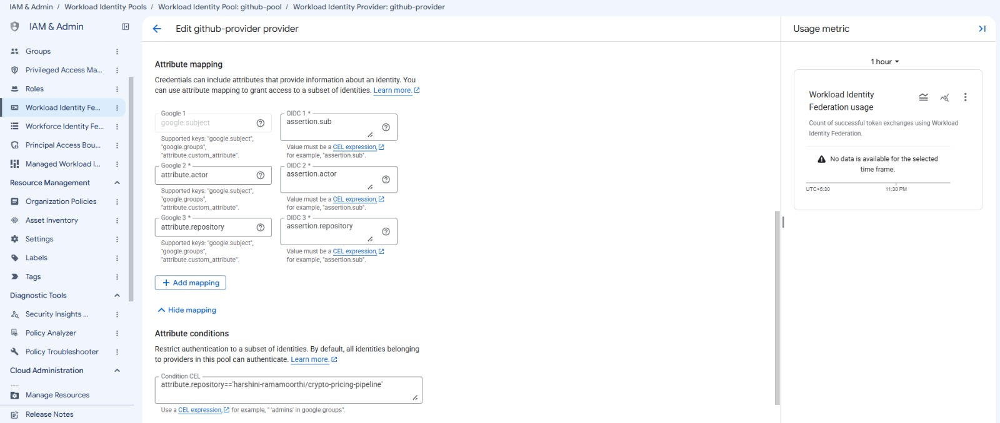

# Automated Crypto Pricing Pipeline

An automated data engineering pipeline that collects cryptocurrency market data from the CoinGecko API, transforms and validates it using Python and Pandas, stores daily snapshots in partitioned BigQuery tables, and provides market insights through a Data Studio dashboard.

The pipeline runs automatically every day using GitHub Actions and authenticates to Google Cloud securely through Workload Identity Federation.

## Live Demo

📊 View the Live Crypto Market Analytics Dashboard https://datastudio.google.com/reporting/2182625e-1f7d-4368-9809-0a33491075b1/page/Dfn8F
---

## Architecture

```text
CoinGecko API
     |
     v
Python + Requests
     |
     v
Pandas Transformation
     |
     v
GitHub Actions
     |
     v
OIDC / Workload Identity Federation
     |
     v
Google BigQuery
     |
     +------------------+
     |                  |
     v                  v
SQL Analytics     Data Studio Dashboard
```

---

## Overview

This project implements an end-to-end automated pipeline for cryptocurrency market data.

Each pipeline execution:

1. Fetches the top 50 cryptocurrencies by market capitalization.
2. Extracts the required fields from the CoinGecko API.
3. Transforms the response into a structured Pandas DataFrame.
4. Handles missing values and duplicate records.
5. Adds a processing date for historical tracking.
6. Loads the data into the corresponding BigQuery date partition.
7. Runs automated tests using Pytest.
8. Executes automatically through GitHub Actions.
9. Uses secure OIDC-based authentication to access Google Cloud.
10. Makes the latest data available for SQL analysis and dashboard visualization.

---

## Features

- Automated cryptocurrency data extraction
- Top 50 cryptocurrencies by market capitalization
- Data transformation and cleaning with Pandas
- Missing-value handling
- Duplicate detection and removal
- Date-based BigQuery partitioning
- Historical daily snapshots
- GitHub Actions scheduling
- Secure OIDC / Workload Identity Federation authentication
- Automated Pytest validation
- Analytical SQL queries
- Data Studio dashboard

---

## Tech Stack

| Technology | Purpose |
|---|---|
| Python | Pipeline and data-processing logic |
| Requests | REST API integration |
| Pandas | Data transformation and cleaning |
| Pytest | Automated testing |
| Google BigQuery | Cloud data warehouse |
| GitHub Actions | Automation and scheduling |
| Workload Identity Federation | Secure cloud authentication |
| SQL | Data analysis |
| Data Studio | Dashboard and visualization |
| Git / GitHub | Version control |

---

## Data Source

The pipeline uses the CoinGecko cryptocurrency markets API.

The request retrieves the top 50 cryptocurrencies ranked by market capitalization, along with:

- USD price
- Market capitalization
- 24-hour trading volume
- 24-hour price change

---

## Data Transformation

The pipeline selects and renames the required fields from the API response.

| Source Field | Output Field |
|---|---|
| `id` | `id` |
| `symbol` | `symbol` |
| `name` | `name` |
| `current_price` | `price_usd` |
| `market_cap` | `market_cap_usd` |
| `total_volume` | `volume_24h_usd` |
| `price_change_percentage_24h` | `price_change_24h_pct` |

A `price_date` field is added to identify the date associated with each pipeline run.

### Data Quality

The transformation stage performs:

- Required column selection
- Column renaming
- Null-value checking
- Missing 24-hour price-change values filled with `0`
- Duplicate-row removal
- Final DataFrame inspection

The resulting dataset contains:

```text
id
symbol
name
price_usd
market_cap_usd
volume_24h_usd
price_change_24h_pct
price_date
```

---

## BigQuery

The transformed data is stored in:

```text
Project: crypto-pricing-pipeline
Dataset: crypto_data
Table: crypto_prices
```

### Schema

| Column | Type |
|---|---|
| `id` | STRING |
| `symbol` | STRING |
| `name` | STRING |
| `price_usd` | FLOAT |
| `market_cap_usd` | INTEGER |
| `volume_24h_usd` | FLOAT |
| `price_change_24h_pct` | FLOAT |
| `price_date` | DATE |

The table is partitioned by:

```text
price_date
```

using daily partitions.

### Partition-Based Loading

The pipeline loads data into the partition corresponding to the current date using a BigQuery partition decorator:

```text
crypto_prices$YYYYMMDD
```

and:

```text
WRITE_TRUNCATE
```

This refreshes the current day's partition without affecting historical partitions.

For example:

```text
2026-09-14 → 50 records
2026-09-13 → 50 records
2026-09-12 → 50 records
```

This allows the table to maintain daily historical snapshots while safely refreshing the latest data.

---

## Latest Data View

A BigQuery view named:

```text
latest_crypto_prices
```

exposes only the most recent available dataset.

The view filters records using the maximum `price_date`, providing a clean source for dashboard visualizations.

---

## GitHub Actions Automation

The workflow is located at:

```text
.github/workflows/daily_pipeline.yml
```

The pipeline is scheduled to run daily at:

```text
00:30 UTC
```

which corresponds to:

```text
06:00 AM IST
```

The workflow can also be triggered manually using GitHub Actions.

### Workflow

```text
Checkout repository
        |
        v
Set up Python
        |
        v
Install dependencies
        |
        v
Run Pytest
        |
        v
Authenticate to Google Cloud
        |
        v
Run pipeline
        |
        v
Load data into BigQuery
```

---

## Secure Authentication

The GitHub Actions workflow does not use a long-lived Google Cloud service-account JSON key.

Instead, authentication uses GitHub's OIDC identity token together with Google Cloud Workload Identity Federation.

```text
GitHub Actions
      |
      v
GitHub OIDC
      |
      v
Workload Identity Provider
      |
      v
Workload Identity Pool
      |
      v
Google Cloud Service Account
      |
      v
BigQuery
```

The Workload Identity configuration restricts access to the project's GitHub repository.

This avoids storing permanent cloud credentials in the repository.

---

## Testing

The project uses Pytest to validate the transformation stage.

The current test suite verifies:

1. Required output columns are present.
2. Missing price-change values are filled correctly.
3. Duplicate records are removed.
4. The transformed dataset contains the expected number of rows.

Run the tests locally:

```bash
pytest
```

Current result:

```text
4 passed
```

The same tests are executed automatically by GitHub Actions before the pipeline loads data into BigQuery.

---

## SQL Analytics

The project includes SQL queries for cryptocurrency market analysis.

### Top Gainers

`sql/top_gainers.sql`

Identifies the top 10 cryptocurrencies with the highest 24-hour price change.

### Top Losers

`sql/top_losers.sql`

Identifies the top 10 cryptocurrencies with the lowest 24-hour price change.

### Market Capitalization Share

`sql/market_cap_share.sql`

Calculates the percentage share of total market capitalization for the leading cryptocurrencies.

---

## Dashboard

The latest BigQuery data is connected to a Data Studio dashboard.

### KPI Cards

- Cryptocurrencies Tracked
- Total Market Cap
- Average 24h Price Change
- Total 24h Trading Volume

### Visualizations

- Top 10 Cryptocurrencies by Market Cap
- Top 10 Gainers
- Top 10 Losers
- Market Cap Distribution — Top 10

The dashboard uses the `latest_crypto_prices` view so that visualizations focus on the latest available market snapshot.

---

## 📸 Project Screenshots

The following screenshots demonstrate the end-to-end pipeline, cloud data storage, automated execution, analytics dashboard, and secure authentication setup.

### 1. GitHub Repository

Project structure, source code, tests, SQL analytics, workflow configuration, and documentation.



### 2. Automated GitHub Actions Pipeline

Successful automated pipeline execution, including testing, Google Cloud authentication, and data loading.



### 3. BigQuery Table Schema

Partitioned BigQuery table containing the cryptocurrency pricing data.



### 4. Latest Cryptocurrency Data

The latest 50 cryptocurrency records successfully loaded into BigQuery.



### 5. Data Studio Dashboard — Overview

Key market metrics, top cryptocurrencies by market capitalization, and top gainers.



### 6. Data Studio Dashboard — Market Analysis

Top cryptocurrency losers and market capitalization distribution.



### 7. Workload Identity Federation

OIDC-based authentication configuration connecting GitHub Actions securely to Google Cloud without storing long-lived service-account credentials.



---

## Project Structure

```text
crypto-pricing-pipeline/
│
├── .github/
│   └── workflows/
│       └── daily_pipeline.yml
│
├── sql/
│   ├── market_cap_share.sql
│   ├── top_gainers.sql
│   └── top_losers.sql
│
├── src/
│   ├── __init__.py
│   ├── extract.py
│   ├── transform.py
│   ├── load.py
│   └── main.py
│
├── tests/
│   └── test_transform.py
│
├── .gitignore
├── main.py
├── pytest.ini
└── requirements.txt
```

### Source Code

| File | Responsibility |
|---|---|
| `src/extract.py` | Fetches cryptocurrency data from CoinGecko |
| `src/transform.py` | Cleans and transforms API data |
| `src/load.py` | Loads transformed data into BigQuery |
| `src/main.py` | Coordinates the pipeline stages |
| `tests/test_transform.py` | Tests transformation logic |
| `sql/` | Contains analytical SQL queries |
| `.github/workflows/daily_pipeline.yml` | Defines automated pipeline execution |

The root-level `main.py` is retained as a reference for the original pipeline implementation.

---

## Local Setup

### 1. Clone the repository

```bash
git clone https://github.com/harshini-ramamoorthi/crypto-pricing-pipeline.git
cd crypto-pricing-pipeline
```

### 2. Create a virtual environment

```bash
python -m venv .venv
```

### 3. Activate the virtual environment

Windows PowerShell:

```powershell
.\.venv\Scripts\Activate.ps1
```

### 4. Install dependencies

```bash
pip install -r requirements.txt
```

### 5. Run tests

```bash
pytest
```

### 6. Run the pipeline

```bash
python src/main.py
```

Google Cloud authentication must be configured locally before running the BigQuery load stage.

---

## Security

The repository excludes local environments, cache files, environment files, and JSON credential files through `.gitignore`.

The project does not store a long-lived Google Cloud service-account key in the repository.

GitHub Actions uses Workload Identity Federation for cloud authentication.

---

## Engineering Concepts Demonstrated

This project demonstrates practical experience with:

- ETL pipeline design
- REST API integration
- Data extraction
- Data transformation
- Data quality validation
- Pandas DataFrames
- BigQuery
- Table partitioning
- SQL analytics
- CI/CD automation
- Scheduled workflows
- GitHub Actions
- OIDC authentication
- Workload Identity Federation
- Automated testing
- Dashboard development
- Cloud data pipelines

---

## Future Improvements

- API retry and exponential backoff
- Multi-page API extraction
- Additional cryptocurrency metrics
- Historical trend analysis
- Data freshness monitoring
- Pipeline failure notifications
- Additional data-quality checks
- More dashboard visualizations
- Price movement alerting

---

## Project Outcome

The completed pipeline provides an automated path from a public cryptocurrency API to a cloud data warehouse and analytics dashboard:

```text
API
 |
 v
Python
 |
 v
Pandas
 |
 v
Automated CI/CD
 |
 v
Secure Cloud Authentication
 |
 v
BigQuery
 |
 v
SQL Analytics
 |
 v
Data Studio
```

The project demonstrates how a Python data-processing script can be developed into a repeatable, tested, automated, and cloud-integrated data engineering pipeline.
